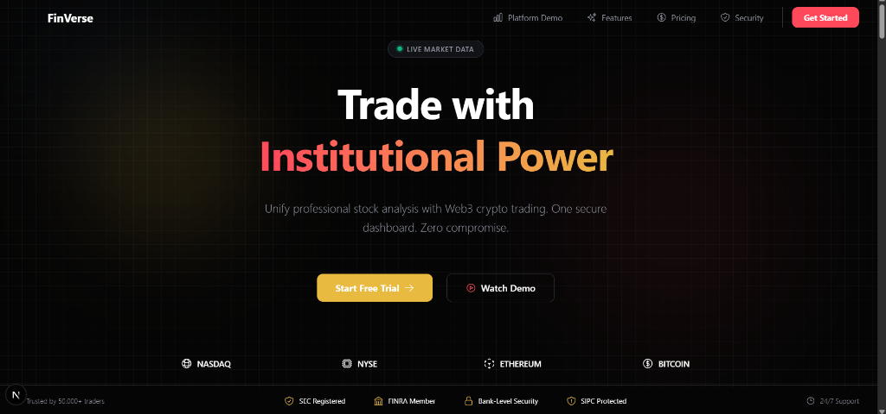
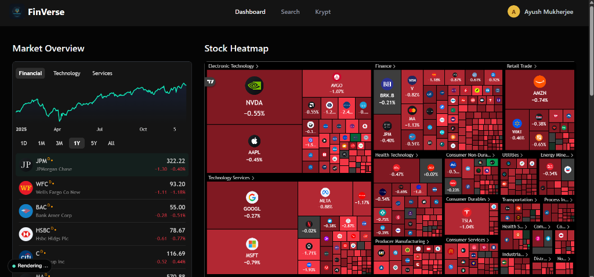
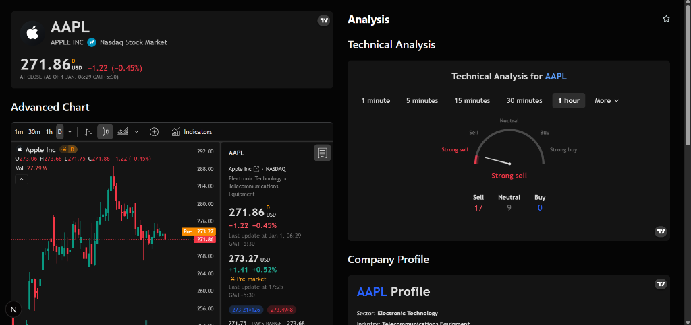
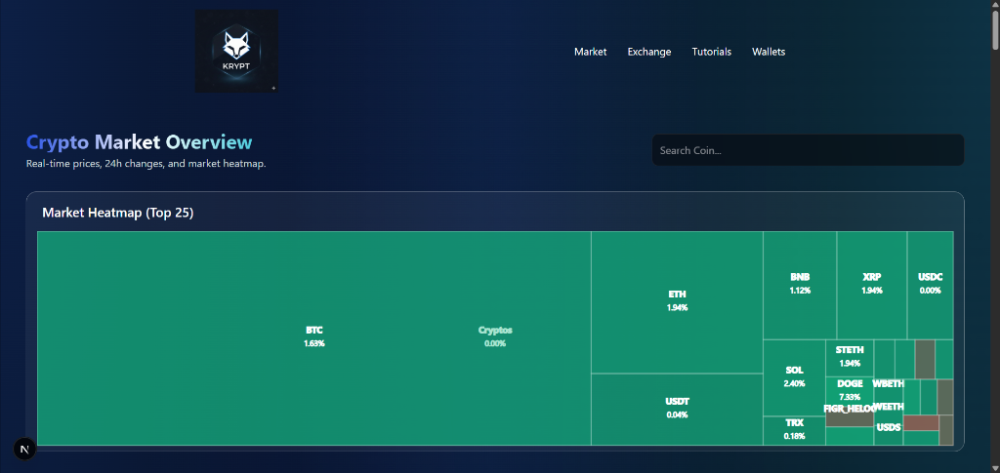

# FinVerse

FinVerse is a comprehensive financial intelligence platform that merges professional-grade stock market analysis with secure Web3 cryptocurrency management. Designed for both traditional investors and modern crypto traders, it provides a unified interface for tracking, analyzing, and managing digital assets.



## Overview

The application is built to deliver real-time insights and seamless user experience. It leverages advanced AI for market summarization and offers sophisticated charting tools for technical analysis. With its integrated crypto wallet and exchange features, FinVerse serves as a bridge between the fiat and blockchain worlds.

## Key Features

### Stock Market Intelligence
- **Real-Time Dashboard**: Monitor market movements with live data updates.
- **Advanced Charting**: Interactive charts with multiple timeframes and technical indicators (TradingView integration).
- **Market Heatmaps**: Visual representation of sector performance and market trends.
- **AI-Powered Insights**: Automated daily market overviews and sentiment analysis powered by Gemini 2.5 Flash Lite.

### Web3 & Crypto Integration (Krypt)
- **Secure Wallet**: Integrated crypto wallet for managing Ethereum and other assets.
- **Exchange Platform**: Seamless interface for swapping and transferring cryptocurrencies.
- **Global Transactions**: Send crypto across the world with low fees and high security.
- **Crypto Market Data**: Real-time tracking of top cryptocurrencies and market cap visualization.

### User Experience
- **Modern UI/UX**: A sleek, dark-themed interface with glassmorphism effects and responsive design.
- **Secure Authentication**: Robust user session management and route protection.
- **Watchlists**: Personalized tracking of favorite stocks and coins.

## Gallery

### Dashboard & AI Overview


### Stock Analysis & Charts


### Crypto Market Heatmap


### Krypt Web3 Interface


## Technology Stack

- **Framework**: Next.js 14 (App Router)
- **Language**: TypeScript
- **Styling**: Tailwind CSS
- **AI Integration**: Google Gemini 2.5 Flash Lite
- **Database**: PostgreSQL with Drizzle ORM
- **Authentication**: Better-Auth
- **State Management**: React Context & Hooks

## Getting Started

### Prerequisites
- Node.js (v18 or higher)
- npm or yarn
- PostgreSQL database

### Installation

1. Clone the repository:
   ```bash
   git clone https://github.com/yourusername/finverse.git
   cd finverse
   ```

2. Install dependencies:
   ```bash
   npm install
   ```

3. Configure environment variables:
   Create a `.env` file in the root directory and add your API keys (Database URL, Auth Secret, Gemini API Key, etc.).

4. Run the development server:
   ```bash
   npm run dev
   ```

5. Open [http://localhost:3000](http://localhost:3000) with your browser to see the result.

## License

This project is licensed under the MIT License.
